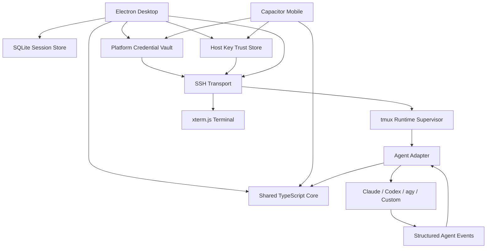
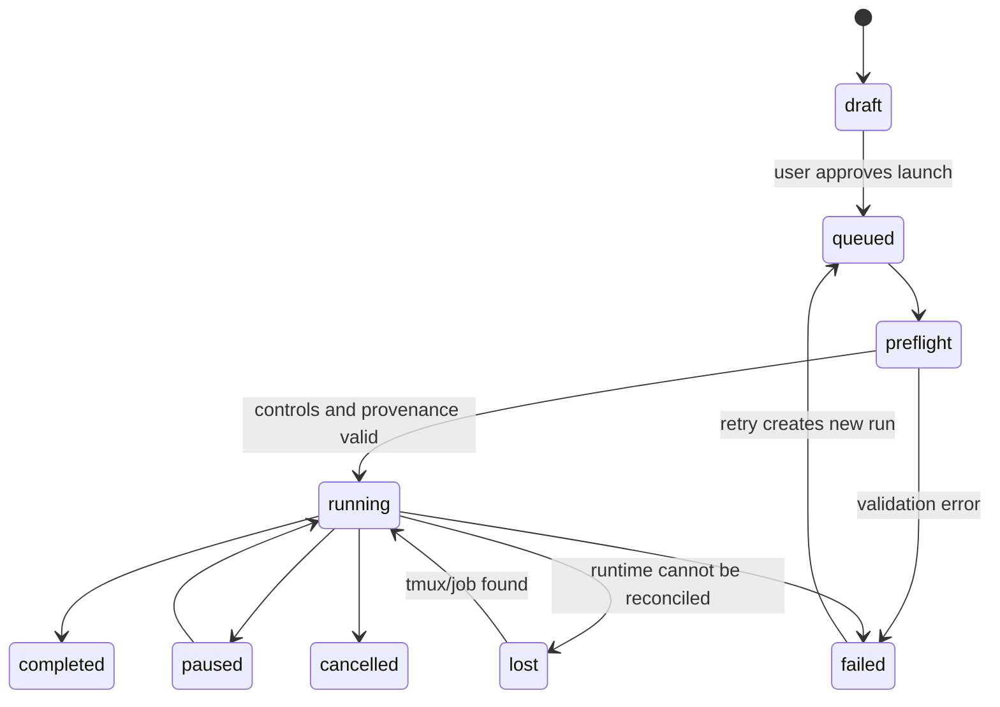

# CozyPad V3 Remote Agent Workspace 規格

## 1. 產品定位

將 手機/本地 連接 遠端主機上的 coding agent 的應用程式。

CozyPad 的責任是：

- 管理 SSH 連線、專案與遠端工作區。
- 管理 tmux 中持續執行的 Claude Code、Codex、`agy` 與未來 agent。
- 將不同 agent 的結構化事件正規化成一致的聊天體驗。
- 提供接近 Claude Desktop 品質的對話、工具、權限、diff、附件與 session 管理 UI。
- 提供完整 SSH PTY Terminal，作為操作、除錯及 agent adapter 降級介面。
- 讓 Desktop 與 Mobile 共用 domain contracts，但使用各自最合適的 UI。
- 提供 Research Lab，定義、執行、追蹤與比較可重現的研究 pipeline、sweep 與 ablation。

CozyPad 不負責：

- 自行實作 LLM agent loop。
- 自行維護 memory、skills、model provider 或 prompt engine。
- 取代 Claude Code、Codex 或其他遠端 agent 的原生 session storage。
- 解析 terminal 畫面來猜測完整聊天語意。

## 2. 移除 Hermes

V3 SHALL 完整移除下列概念：

- Hermes engine、harness、memory、skills、provider profile。
- Hermes session store、tool registry、approval policy。
- Hermes remote runtime bootstrap 與 sync manager。
- Hermes 專屬 UI、設定、API key 與本機資料目錄。
- 所有 `Hermes*` domain type、command、event 與 repository package。

舊 Flutter 實作中的下列檔案屬於遷移來源，不得搬進 V3：

```text
lib/hermes/hermes_engine.dart
lib/hermes/hermes_models.dart
lib/hermes/hermes_native_tab.dart
lib/hermes/hermes_widgets.dart
lib/hermes/harness/hermes_harness.dart
lib/hermes/rebuild/hermes_remote_runtime.dart
```

可以保留的是其中與產品無關、經重新命名並重新測試的通用概念，例如：

- SSH host verification。
- tmux 啟動、列舉、attach、interrupt。
- 遠端檔案與 telemetry parser。
- agent process 狀態與一般化的 tool/event UI pattern。

## 3. 技術選型

| 層級 | 選擇 |
| --- | --- |
| Desktop | Electron + React + TypeScript + Vite |
| Desktop Terminal | xterm.js + `ssh2` PTY stream |
| Desktop persistence | SQLite |
| Desktop SSH profile / host trust | Electron main process + `safeStorage` |
| Research analytics | Parquet artifacts + embedded DuckDB adapter |
| Charts and tables | Apache ECharts + TanStack Table |
| Mobile | Capacitor + 共用同一套 React + TypeScript |
| Android SSH secrets | Native credential vault + Android Keystore AES-256-GCM |
| Shared contracts | TypeScript + Zod |
| Monorepo | pnpm workspace |
| Remote process supervisor | tmux |
| Remote agent integration | 每個 agent 一個 adapter |
| Transport | SSH；Mobile 可選原生 SSH plugin（直連，與 Flutter 版同等）或配對 Desktop／authenticated WSS gateway |
| Python | CozyPad 核心不內嵌；遠端研究專案可自由使用 |
| Rust | V3 第一版不需要 |

### 3.1 Shell 決策與 Tauri 遷移保險

（2026-07-29 定案）Desktop shell 採 Electron、Mobile shell 採 Capacitor，理由：

- 全專案單一語言（TypeScript），無 Rust／原生編譯稅；任何貢獻者 `pnpm install && pnpm dev` 即可跑起完整 app。
- 開發機 toolchain 最輕：Desktop 只需 Node + pnpm；Android 只需標準 Android SDK + JDK（無 NDK、無交叉編譯）。
- `ssh2` 與 xterm.js 是最成熟的 SSH／terminal 組合（VS Code 同款生態）。
- 已知代價：Windows 安裝包（~100MB）與記憶體佔用高於 Flutter 現況；以 developer workstation 定位接受。

Tauri 2 是既定的效能逃生路線，且必須維持為「換殼」而不是「重寫」：

- React app、shared core、contracts、chat UI 在兩種 shell 下完全相同；遷移範圍僅限 desktop shell 與 transport adapter（`ssh2` → russh）。
- 為維持可遷移性，下列規則為硬性架構約束：
  - Renderer／React app 不得直接 import `electron`、`@capacitor/*` 或任何 shell API。
  - 平台能力（SSH、檔案、secrets、視窗控制）一律經由 `PlatformBridge` typed interface 取得。
  - React app 必須可在純瀏覽器 + mock adapter 模式下啟動與測試。
- 遷移評估觸發條件（參考值，非硬 gate）：Windows 閒置記憶體 > 500MB、冷啟動 > 3 秒、或安裝包體積成為使用者實際抱怨來源。

與前版草案的差異：Mobile 由 React Native + Expo 改為 Capacitor，使 Desktop 與
Mobile 共用同一套 React app；舊草案中的 React Native／Expo 內容不再適用。

## 4. 系統架構



### 4.1 邊界

- React renderer 不得直接存取 Node.js、SSH、filesystem 或 process API。
- Electron main process 擁有 SSH、tmux、SQLite、secrets 與 agent process lifecycle。
- Android `SshPlugin` 擁有 socket、SSH credential 與 host-key trust；WebView 只提交
  新 credential，不得列舉、讀回或覆寫已信任 fingerprint。
- Preload 只暴露經 Zod 驗證的 typed IPC。
- Shared core 不得 import Electron、Capacitor、`ssh2` 或 xterm.js。
- React app 不得直接 import shell API；平台能力一律經由 `PlatformBridge` adapter（見 3.1），使 desktop shell 可整顆替換（Electron ⇄ Tauri）。
- Agent adapter 不得直接操作 React state。
- Terminal stream 與 structured chat event stream 必須分開。

## 5. Session Identity

### 5.1 核心原則

一個 CozyPad remote-agent session 必須同時由以下身份辨識：

1. 遠端主機／連線身份。
2. tmux server 與 tmux `#{session_id}`。
3. agent 類型。
4. agent 自己的 conversation/session ID。

正式 identity：

```text
RemoteAgentSessionKey =
  connectionProfileId
  + tmuxSocket
  + tmuxSessionId
  + agentKind
  + agentConversationId
```

不得只使用：

- tmux session name：使用者可以重新命名，且不同主機可能重複。
- tmux `#{session_id}`：只在同一個 tmux server 生命週期內唯一。
- conversation ID：不同 agent namespace 可能碰撞，且無法定位目前 process。
- working directory：同一專案可同時存在多個對話。

### 5.2 Domain Model

```ts
type AgentKind = 'claude' | 'codex' | 'agy' | `custom:${string}`;

interface RemoteAgentSessionIdentity {
  connectionProfileId: string;
  remoteHostFingerprint: string;
  tmuxSocket: string;
  tmuxSessionId: string;       // tmux #{session_id}，保留原始值，例如 "$3"
  tmuxPaneId?: string;         // runtime locator，例如 "%7"，不是主要 identity
  agentKind: AgentKind;
  agentConversationId: string;
}

interface RemoteAgentSession {
  id: string;                  // CozyPad 本機 UUID primary key
  identity: RemoteAgentSessionIdentity | null;
  provisionalIdentity: {
    connectionProfileId: string;
    tmuxSocket: string;
    tmuxSessionId: string;
    agentKind: AgentKind;
    launchNonce: string;
  };
  projectId: string;
  cwd: string;
  title: string;
  status: 'starting' | 'ready' | 'running' | 'waiting_approval'
    | 'disconnected' | 'exited' | 'error';
  createdAt: string;
  updatedAt: string;
  lastEventSequence: number;
}
```

### 5.3 建立與綁定流程

1. CozyPad 建立本機 `id` 與 `launchNonce`。
2. 在指定 tmux socket 啟動 session，取得真正的 `#{session_id}` 與 pane ID。
3. Agent adapter 啟動 agent 並讀取 structured initialization event。
4. Adapter 從 agent event 取得 `agentConversationId`。
5. CozyPad 原子性地將 provisional session 綁定為正式 composite identity。
6. 若 conversation ID 尚未出現，UI 顯示 `Starting…`，不得以 session name 假裝正式 ID。

SQLite SHALL 建立 composite unique index：

```sql
UNIQUE (
  connection_profile_id,
  tmux_socket,
  tmux_session_id,
  agent_kind,
  agent_conversation_id
)
```

### 5.4 Reconciliation

每次連線或重連時 SHALL：

1. 使用 `tmux list-sessions` 取得 `#{session_id}`、名稱、建立時間、attached 狀態。
2. 使用 `tmux list-panes` 取得 pane ID、PID、current command 與 cwd。
3. 讀取 CozyPad remote metadata。
4. 由 adapter 查詢或讀取 agent conversation ID。
5. 與本機 SQLite session 合併。
6. 標示 `ready`、`disconnected`、`exited` 或 `orphaned`，不得靜默建立重複 session。

## 6. tmux 的角色

tmux 是 process supervisor 與 reconnect anchor，不是聊天協定。

tmux 負責：

- Agent process 在 UI 或 SSH 斷線後繼續執行。
- 提供穩定的 session/pane runtime locator。
- attach、detach、interrupt、kill 與 fallback terminal。
- 保留除錯所需的原始 process 畫面。

tmux 不負責：

- 判斷 user/assistant/tool message。
- 產生 message ID 或 conversation ID。
- 讓 `capture-pane` 成為主要聊天資料源。
- 從 ANSI 畫面推測 approval、diff 或 tool result。

### 6.1 強制規則與遠端設定

- **所有 agent conversation session 一律在 tmux 中啟動**，不得以直接 SSH exec
  或背景 process 取代；CozyPad 使用單一受管 socket（預設 `default`，可由
  `COZYPAD_TMUX_SOCKET` 覆寫）。
- 使用者的 tmux 個人化行為（如滑鼠滾輪捲動 pane 歷史）屬**遠端設定**：由 CozyPad
  的 Settings → 遠端設定切換，寫入 `~/.tmux.conf` 的 CozyPad 管理區塊
  （`# >>> cozypad managed >>>`）並即時套用，不覆寫使用者其他設定。
- 設定分兩層：**遠端設定**（存在主機、跨裝置一致，如 tmux 選項、socket）與
  **Desktop 設定**（只影響本機 UI，如主題、字型）。
- `smux`（多 agent 討論模式）為後續項目，不阻擋 Phase 2/3；其 session 同樣必須
  建立在 tmux 之上。

`capture-pane` 只能用於：

- Terminal fallback。
- Adapter 無 structured mode 時的 degraded view。
- 啟動失敗或 protocol mismatch 的診斷。

## 7. Agent Adapter

### 7.1 Contract

```ts
interface RemoteAgentAdapter {
  readonly kind: AgentKind;

  detect(ctx: RemoteContext): Promise<AgentInstallation>;
  capabilities(ctx: RemoteContext): Promise<AgentCapabilities>;
  start(req: StartAgentRequest): AsyncIterable<NormalizedAgentEvent>;
  resume(req: ResumeAgentRequest): AsyncIterable<NormalizedAgentEvent>;
  send(req: SendTurnRequest): AsyncIterable<NormalizedAgentEvent>;
  interrupt(req: InterruptAgentRequest): Promise<void>;
  reconcile(req: ReconcileAgentRequest): Promise<AgentReconciliation>;
}
```

每個 adapter 必須輸出一致事件：

```ts
type NormalizedAgentEvent =
  | UserMessageEvent
  | AssistantMessageStartedEvent
  | AssistantTextDeltaEvent
  | AssistantMessageCompletedEvent
  | ActivityEvent
  | ToolCallStartedEvent
  | ToolCallUpdatedEvent
  | ToolCallCompletedEvent
  | ApprovalRequestedEvent
  | ApprovalResolvedEvent
  | FileDiffEvent
  | CommandOutputEvent
  | UsageEvent
  | TurnCompletedEvent
  | AgentErrorEvent;
```

所有事件 SHALL 包含：

- `eventId`
- `sequence`
- `localSessionId`
- `agentKind`
- `agentConversationId`（取得後）
- `timestamp`
- `rawEventVersion`
- typed payload

### 7.2 Structured-first

Adapter 優先順序：

1. 官方 app-server、SDK 或 JSON-RPC protocol。
2. 官方 JSON／JSONL／stream-json CLI output。
3. 版本化的 machine-readable log。
4. Terminal fallback。

不得把 ANSI／TUI scraping 當成 production chat UI 的主要來源。

### 7.3 Claude Adapter

Claude adapter 預期使用官方非互動 structured mode：

- `--output-format stream-json`
- structured session ID
- `--resume <session-id>`

實際 flags SHALL 在 capability detection 後決定，不得假定所有遠端版本相同。

### 7.4 Codex Adapter

Codex adapter 優先採用：

1. 穩定且版本相容的 app-server protocol。
2. `codex exec --json` 與 `codex exec resume <session-id> --json`。
3. Interactive TUI terminal fallback。

目前本機 Codex 的 app-server 仍標示 experimental，因此 V3 SHALL：

- 進行 version/capability handshake。
- 保存 protocol version。
- 支援 JSONL exec fallback。
- 不把 experimental method 寫死進 shared core。

### 7.5 agy Adapter

`agy` 暫時視為正式的第三種 `AgentKind`。

開始實作前必須補齊：

- 可執行檔與版本偵測方式。
- structured output 或 protocol。
- conversation session ID 的來源。
- resume、interrupt、approval 與 tool event 能力。

若 `agy` 沒有 structured protocol，只能先提供 Terminal degraded mode，不宣稱達到完整 Chat UX。

## 8. Remote Event Durability

網路中斷後必須可以續接，不能只依賴即時 stdout。

每個 remote-agent session SHALL 在遠端保存：

```text
~/.cozypad/sessions/<local-session-id>/
├── metadata.json
├── raw-events.ndjson
├── stderr.log
└── requests/
```

規則：

- Remote raw event 是重新解析與除錯來源。
- 本機 SQLite 保存 normalized events、索引、UI metadata 與最後 sequence。
- 重連以 `lastEventSequence` 補抓缺少事件。
- Parser 必須冪等；同一 `eventId` 不得插入兩次。
- Provider raw schema 改變時，保留原始資料並標記 adapter version。
- Secret、完整環境變數與 credential 不得寫入 raw event log。

## 9. Chat UX 品質標準

Remote Agent Chat 是 V3 的主畫面，不是附屬 tab。

### 9.1 Information Architecture

Agent 是第一層導航，session 是第二層導航。V3 不把所有 agent session 預設攤平成同一張清單。

```text
Agents
├── Claude
│   ├── Session A
│   └── Session B
├── Codex
│   ├── Session C
│   └── Session D
├── agy
│   └── Session E
└── Custom adapters
```

Desktop SHALL 提供 agent page tabs：

```text
[ Claude ] [ Codex ] [ agy ] [ Custom… ]                         [＋]
```

選定 agent page 後，左側 sidebar 只顯示該 agent 的 sessions，再依 host、project 與狀態分組。Session composite identity 不因 UI 分組而改變；`agentKind` 仍是 identity 的正式欄位。

路由模型：

```text
/agents/:agentKind
/agents/:agentKind/sessions/:localSessionId
```

規則：

- 每個 agent page 保留自己的 selected session、scroll position、composer draft 與 filters。
- 切換 agent page 不得中止、重新啟動或 unmount 正在執行的 remote session controller。
- Agent tab 顯示 running、waiting approval、unread 與 error badge。
- 未安裝的 agent 顯示 detection/setup state，不顯示空白聊天頁。
- Adapter 可以增加 agent-specific actions，但 message、tool、diff 與 approval 使用共用 Chat UI primitives。
- 全域搜尋可以跨 agent；搜尋結果必須標示 agent、host、project 與 session。
- 可以提供 `Activity` overview page 顯示所有 agent 的狀態與待處理 approval，但不得把不同 session 的 message timeline 合併成一段對話。
- Mobile 使用 top tabs、segmented control 或 agent switcher 呈現相同階層，不要求與 Desktop 像素一致。

### 9.2 Layout

```text
┌──────────────────────── Agent page tabs ──────────────────────────────────┐
│  Claude          Codex          agy          Custom                 ＋     │
├─────────────────┬──────────────── Chat timeline ───────────────┬───────────┤
│ Current agent   │ messages, tools, diffs, approvals, errors   │ Context   │
│ sessions        │                                              │ files     │
│ host/project    │                                              │ changes   │
│ tmux status     ├──────────────────────────────────────────────┤ usage     │
│ unread/running  │ composer, attachments, mode, send/interrupt │ runtime   │
└─────────────────┴──────────────────────────────────────────────┴───────────┘
```

### 9.3 必要能力

- Token-by-token streaming，不造成整個 timeline re-render。
- Markdown、GFM table、syntax highlighting、copyable code block。
- Tool call card：狀態、參數摘要、可展開原始輸出、耗時、錯誤。
- Diff card：檔名、增刪行、split/unified 切換、open file。
- Approval card：風險摘要、精確 command/path、一次允許／拒絕。
- Composer：多行輸入、IME、附件、圖片、drag-and-drop、paste image。
- Stop/interrupt、retry、resume、fork（agent 支援時）。
- Agent page tabs：依 agent 分區並顯示 running/unread/approval 狀態。
- Session sidebar：只列出目前 agent，再依 host、project、running/unread 分組。
- 全文搜尋：conversation title、message、tool、file path。
- reconnect banner 與補事件進度，不重複訊息。
- Accessibility：完整鍵盤操作、focus ring、screen-reader labels。
- 大量歷史訊息使用 virtualization。
- Terminal 可從 session 開啟，但不佔用主要 chat timeline。

### 9.4 不顯示隱藏推理

UI 可以顯示 agent 官方提供的 activity/status/summary，但不得：

- 嘗試重建隱藏 chain-of-thought。
- 把 stderr 或 debug log 當作 reasoning。
- 將未經分類的 raw JSON 直接顯示給一般使用者。

### 9.5 UX 驗收指標

- 首個 streaming event：LAN SSH 條件下 p95 小於 500 ms，不含模型首 token latency。
- 10,000 個 timeline items 仍可平順捲動。
- 斷線 30 分鐘後重連，不遺失、不重複已持久化事件。
- 同一 tmux session 中切換或 resume 不同 conversation 時不得串錯歷史。
- 切換 Claude、Codex、agy page 後，各 page 的 selected session、草稿與捲動位置保持不變。
- `Activity` overview 不得將不同 agent 或 session 的訊息串成單一 timeline。
- 中文 IME、emoji、code paste 與大型 diff 不破版。
- agent 執行中關閉視窗再重開，session 能正確恢復。

## 10. Terminal

Terminal 與 Chat 是同一 remote session 的兩個 view：

- Chat view：只消費 normalized structured events。
- Terminal view：直接消費 SSH PTY byte stream。

Terminal SHALL 支援：

- bash/zsh、vim、less、htop、tmux。
- alternate screen、true color、mouse mode。
- CJK width、中文 IME、emoji、combining character。
- bracketed paste、resize、search、copy。
- reconnect 到既有 tmux session。

Terminal fidelity gate 未通過前，不得移除 Flutter 版可用的 terminal fallback。

## 11. Persistence Schema

最低資料表：

```text
connection_profiles
projects
remote_agent_sessions
agent_events
session_messages
tool_calls
approvals
file_diffs
attachments
ui_preferences
research_studies
research_experiments
research_runs
research_run_parameters
research_metric_series
research_artifacts
ablation_plans
research_dashboard_layouts
```

SQLite 是 CozyPad UI 索引與快取，不得取代 agent 原生 conversation storage。

Research metadata 與狀態索引存於 SQLite；高密度 metric samples SHALL 以 append-only
JSONL 接收，再壓縮為 Parquet artifact。分析查詢經 `research-store` adapter 執行，
不得在 React renderer 直接掃描完整 metrics 檔案。

刪除 CozyPad session 時預設只刪除本機索引。下列動作必須分開確認：

- Kill tmux session。
- 刪除 remote raw events。
- 刪除 agent 原生 conversation。
- 刪除 remote workspace files。

## 12. Repository Layout

```text
cozypad/
├── apps/
│   ├── app/                   # 共用 React app（Vite；瀏覽器 + mock adapter 模式由此啟動）
│   ├── desktop/               # Electron shell
│   │   ├── main/
│   │   └── preload/
│   └── mobile/                # Capacitor shell（載入 apps/app）
├── packages/
│   ├── contracts/
│   ├── core/
│   ├── agent-adapter/
│   ├── adapter-claude/
│   ├── adapter-codex/
│   ├── adapter-agy/
│   ├── ssh-transport/
│   ├── tmux-runtime/
│   ├── event-store/
│   ├── chat-ui/
│   ├── terminal-ui/
│   ├── telemetry/
│   ├── research-core/
│   ├── research-runner/
│   ├── research-store/
│   ├── research-ui/
│   ├── metrics-ingestion/
│   └── test-fixtures/
├── remote/
│   └── scripts/
├── docs/
│   ├── adr/
│   └── protocols/
├── legacy/
│   └── flutter/
└── SPEC.md
```

## 13. Security

- SSH 驗證方式支援密碼與 private key；加密私鑰可另外提供 passphrase。
- Profile list 與一般 metadata 不得包含密碼、私鑰或 passphrase。Secret 只能單向送進
  privileged platform layer，儲存後不得回傳 renderer／WebView 或寫入 log。
- Desktop 必須以 Electron `safeStorage` 加密完整 profile 與 host trust，包含名稱、
  host、port、username、驗證方式、credential 與 fingerprint；舊版明文 metadata
  必須以原子寫入自動遷移。Android 必須以 Android Keystore 管理的 AES-256-GCM
  金鑰保護 credential 與 host trust。OS secure storage 不可用、資料損壞或無法解密時
  必須 fail closed，不得退回明文儲存或靜默清空。
- 使用者不選擇記憶時，credential 僅保留在 main/native process memory，讓同一次
  app 執行期間可自動重連；process 結束後即失效。
- Credential 必須綁定 profile ID、host、port、username 與 auth method。
  任一欄位不一致時不得取用舊 credential，避免 renderer metadata 遭竄改後轉送 secret。
- 使用 SSH host key verification；未知或變更的 fingerprint 必須提示。Fingerprint
  採 OpenSSH `SHA256:` 格式，信任資料只由 privileged platform layer 管理。
- Desktop 與 Android 使用明確的安全演算法白名單；禁止 SHA-1、DSA、CBC、3DES、
  RC4 與 MD5，且不得為相容舊主機而靜默降級。
- Host-key prompt 必須有逾時與拒絕路徑；fingerprint 變更不得沿用先前信任。
- Android release 禁止 cleartext traffic、系統資料備份與 WebView release debugging，
  並啟用 shrinking／obfuscation。正式 APK 與 Desktop package 缺少簽章資訊時必須拒絕建置。
- 經產品負責人明確核准的內部原型 prerelease 可附 debug-signed APK 或 unsigned Desktop
  installer，但檔名與 release notes 必須標示 `Internal`、列出簽章狀態與 SHA-256，
  且不得標成正式或 latest release。
- Agent authentication 沿用遠端 CLI 自己的 credential，不複製到 CozyPad。
- Electron renderer 啟用 sandbox、context isolation 與嚴格 CSP。
- 所有 IPC、remote metadata 與 provider event 都經 schema validation。
- Approval UI 必須顯示精確 command、cwd、host 與可能影響。
- 不提供全域「永遠允許所有操作」捷徑。
- `tmux send-keys` 不得直接拼接使用者 prompt 成 shell command。
- Prompt 與附件使用檔案或 stdin 傳遞，並採 request ID 隔離。
- 遠端 `.cozypad` 目錄使用使用者專屬權限。

## 14. Migration Plan

### Phase 0：契約與 fixtures

- 建立 monorepo、contracts、normalized event schema。
- 收集 Claude/Codex/agy structured event fixtures。
- 建立 tmux identity 與 reconciliation tests。

### Phase 1：Desktop Terminal

- Electron + SSH + xterm.js。
- 取得 `#{session_id}` 與 pane identity。
- 通過 Terminal acceptance matrix。

### Phase 2：Claude vertical slice

- Claude adapter structured streaming。
- 新建、resume、interrupt、tool/diff/approval UI。
- 完成 session composite identity。

### Phase 3：Codex vertical slice

- Codex capability handshake。
- app-server 或 JSONL exec adapter。
- conversation resume 與 reconnect。

### Phase 4：Chat productization

- Session sidebar、搜尋、附件、virtualization。
- Offline/reconnect、event durability、error recovery。
- UX、accessibility 與效能驗收。

### Phase 5：agy 與 custom adapters

- 補齊 agy protocol。
- 發布可版本化的 adapter SDK。

### Phase 6：其餘工作區

- Files、Monitor、Tasks、Projects、Settings。
- 移轉舊連線資料，但不移轉 Hermes memory/session。
- 舊 SSH profile、credential 與 host-key trust 只允許在 privileged platform layer
  進行一次性遷移；遷移成功後移除舊 secret，失敗時保留舊資料以便安全重試。

### Phase 6A：Research Lab

- Study、Experiment、Run 與 pipeline manifest。
- Generic command runner、metrics ingestion、run table 與 learning curves。
- Baseline、單因子 ablation、重複 seeds 與 control drift 檢查。
- Agent-assisted plan authoring 與 failure analysis，但 launch 與變更仍需使用者確認。

### Phase 7：Mobile

- 以 Capacitor 包裝共用的 React app；共用 contracts、session list 與 chat UI primitives。
- **Transport 有兩條路，不互斥：**
  - **原生 SSH plugin（直連）**：Capacitor plugin 包 Android sshj／iOS libssh2，實作
    同一個 `PlatformBridge`。WebView 本身沒有 raw TCP，必須由原生層提供；
    Flutter 版以 `dartssh2` 達成的直連能力即由此對應。Android 已落地密碼與 SSH Key
    登入、native credential vault、host-key trust、keepalive 與自動重連。
  - **配對 Desktop 或 authenticated gateway**：適合不想在手機上管理金鑰／密碼的情境。
- Android 下載遠端檔案不得依賴 WebView 的 `blob:`／`<a download>` 行為。Android 10+
  必須經原生 `MediaStore.Downloads` 寫入 `Downloads/CozyPad`；Android 7–9 使用
  `ACTION_CREATE_DOCUMENT`。兩者都必須保留原始檔名、明確設定 MIME，未知格式使用
  `application/octet-stream`，並拒絕路徑分隔符與控制字元；不得要求廣泛儲存權限。
- Mobile 不直接解析 agent raw protocol。

### Phase 8：Cutover

- 達到 Desktop release gates。
- 停止 Flutter 功能開發。
- 封存 Flutter 與刪除 Hermes runtime。

## 15. Release Gates

### Gate A：Identity

- 同一 host 上 100 個 tmux sessions 不碰撞。
- session rename 後 identity 不變。
- tmux server restart 後不把回收的 `$N` 誤認為舊 session。
- 相同 conversation ID 在不同 agent/host 不碰撞。
- provisional identity 可安全升級成正式 identity。

### Gate B：Structured Chat

- Claude 與 Codex 均通過 start、stream、resume、interrupt。
- Tool、diff、approval、error、usage 事件有 contract tests。
- ANSI scraping 不參與正常 chat rendering。

### Gate C：Durability

- SSH 中斷、app crash、系統睡眠後能補抓事件。
- event deduplication 與 sequence gap detection 通過。
- raw event schema 變更不會破壞既有 conversation。

### Gate D：UX

- Streaming、長對話、搜尋、附件、diff、approval、鍵盤操作通過。
- 中文 IME 與 accessibility 通過。
- Agent page tabs 正確隔離各 agent 的 session list、草稿、選取狀態與 unread badge。
- 跨 agent `Activity` 只聚合狀態與待處理工作，不合併 conversation timeline。
- Chat 與 Terminal 可在同一 session 間切換且不丟失焦點或狀態。

### Gate E：Hermes Removal

- V3 build 不包含 Hermes、Python runtime 或 Hermes credentials。
- 新 repository package 不得使用 `Hermes*` 命名。
- Flutter 舊資料 migration 不讀取或上傳 Hermes memory/session。

### Gate F：Research Reproducibility

- 任一完成的 run 都能匯出完整 manifest、provenance、metrics 與 artifact index。
- Ablation run 的 materialized config 只能與 baseline 相差宣告過的 factor。
- 相同 study 內不得靜默混合不同 dataset revision、metric definition 或 split。
- App restart、SSH 斷線與 tmux reattach 後，run status 與 metrics 不重複、不遺失。
- 表格篩選、圖表資料集與統計摘要使用同一組 run selection。

### Gate G：SSH Security

- Desktop 與 Android 均通過密碼、未加密 private key、加密 private key 與
  「不記憶但同次執行可重連」測試。
- Renderer／WebView 無法從 profile list、bridge response、log 或 error message
  取得已儲存的 credential。
- 未知 host key、變更 host key、提示逾時與使用者拒絕都會安全中止連線。
- 弱演算法測試證明 SHA-1、DSA、CBC、3DES、RC4 與 MD5 不會被協商。
- Android release manifest、R8 與簽章 gate 通過；發行資產不得包含 source map、
  keystore、簽章密碼或環境專屬絕對路徑。
- 內部原型 prerelease 若依明確核准延後正式簽章，仍須驗證 manifest、資產內容、
  commit 對應、SHA-256 與實際簽章狀態，並同時揭露於 release notes。
- Android 遠端檔案下載須以原檔名與 byte-exact 內容寫入公開 Downloads／使用者選取
  位置；未知副檔名不得被改名為 XML，且 manifest 不得新增廣泛儲存權限。

## 16. 已定案事項

- Hermes 整體移除，不重寫、不相容、不遷移對話。
- CozyPad 核心是 remote-agent workspace，不是 agent runtime。
- Session 以 tmux session identity 與 agent conversation identity 共同區分。
- Agent 是第一層 page tab；每個 agent page 管理自己的 session sidebar。
- tmux 負責 process persistence；structured protocol 負責 Chat UI。
- Desktop 先完成，Mobile 後接同一份 contracts。
- Desktop shell V1 採 Electron；效能或體積成為實際問題時，遷移目標為 Tauri 2，
  React app 與 shared core 不得因此重寫（約束見 3.1）。
- Mobile shell 採 Capacitor 並與 Desktop 共用同一套 React app；不採 React Native。
- Android 第一版採原生 SSH plugin 直連；authenticated gateway 保留為可選路徑，
  不作為密碼／SSH Key 直連的前置條件。
- CozyPad 發布物的技術主線維持 TypeScript；V3 第一版不內嵌 Python 或 Rust runtime，
  但 Research Lab 可執行遠端專案自己的 Python、Rust 或 shell workflow。
- Research Lab 是獨立頂層 workspace；研究 run、tmux runtime 與 agent conversation 各自有 ID，只以明確外鍵連結。

## 17. 待確認但不阻塞架構

- `agy` 的完整產品名稱、CLI command 與 protocol。
- iOS 原生 SSH plugin 與 authenticated gateway 的實作優先順序。
- Codex app-server 穩定後，是否淘汰 JSONL exec fallback。
- 是否在遠端部署常駐 bridge；Phase 0 先以 SSH channels 與 durable event files 驗證。

## 18. Research Lab

### 18.1 產品目標與邊界

Research Lab 是 CozyPad 的獨立頂層 workspace，用來把「研究問題、實驗設定、遠端執行、
metrics、artifact 與結論」放進同一條可重現的 pipeline。

第一層導航：

```text
Workspace
├── Agents
├── Research Lab
├── Terminal
├── Files
├── Monitor
└── Settings
```

Research Lab SHALL：

- 讓使用者建立前處理、資料切分、正規化、模型初始化、訓練、評估與匯出的有向無環圖。
- 把 batch size、epochs、learning rate、初始化來源、freeze policy 等定義成可控制的研究變因。
- 產生 baseline、sweep、ablation 與 repeated-seed runs。
- 將每個 run 的設定、程式版本、資料版本、環境、資源、metrics 與 artifacts 一起保存。
- 提供 graph、table、charts 與可儲存的 dashboard。
- 允許 remote agent 協助產生計畫、檢查設定、解讀失敗與撰寫摘要。

Research Lab SHALL NOT：

- 自行成為 PyTorch、JAX、TensorFlow 或其他訓練框架。
- 強制研究專案改用特定語言；Python、Rust 或 shell command 都經 runner contract 執行。
- 把 agent conversation ID 當作 research run ID。
- 因缺少 metric 而自動填入 `0`，或在未提示下排除 failed runs。
- 在 controls 已漂移時宣稱某個 factor 具有因果效果。

### 18.2 核心階層與 Identity

```text
Project
└── Study                         一個研究問題與共同資料語意
    ├── Experiment                一個版本化的執行計畫
    │   ├── Baseline Run
    │   ├── Ablation Run(s)
    │   └── Sweep Run(s)
    └── Dashboard(s)
```

```ts
type ResearchRunStatus =
  | 'draft'
  | 'queued'
  | 'preflight'
  | 'running'
  | 'paused'
  | 'completed'
  | 'failed'
  | 'cancelled'
  | 'lost';

interface ResearchStudy {
  id: string;
  projectId: string;
  title: string;
  researchQuestion: string;
  objectiveMetric: string;
  objectiveDirection: 'minimize' | 'maximize';
  createdAt: string;
  updatedAt: string;
}

interface ResearchExperiment {
  id: string;
  studyId: string;
  manifestVersion: number;
  manifestHash: string;
  baselineSnapshotId: string;
  status: 'draft' | 'locked' | 'running' | 'completed' | 'archived';
}

interface ResearchRun {
  id: string;                       // CozyPad UUID；唯一正式 run identity
  experimentId: string;
  materializedConfigHash: string;
  status: ResearchRunStatus;
  executionId?: string;             // queue/process execution identity
  tmuxSessionId?: string;           // runtime locator，不是 run identity
  tmuxPaneId?: string;
  agentSessionId?: string;          // 可選的協作對話連結
  schedulerJobId?: string;          // 未來 Slurm 等 scheduler adapter
  startedAt?: string;
  endedAt?: string;
}
```

Identity 規則：

- `ResearchRun.id`、`executionId`、tmux identity、scheduler job ID 與
  `RemoteAgentSession.id` 必須分開。
- 一個 agent session 可以協助多個 runs；一個 run 也可被多個 agent sessions 討論。
- run 的狀態由 runner/reconciliation 決定，不由聊天頁是否開啟決定。
- 重新執行產生新的 `ResearchRun.id`，即使 materialized config 完全相同；兩者以
  `retryOfRunId` 或 `replicateGroupId` 關聯。

### 18.3 Pipeline DAG

預設 stage types：

```text
Dataset Snapshot
  → Split
  → Preprocess
  → Normalize / Augment
  → Initialize Model
  → Train
  → Evaluate
  → Export Artifacts
```

每個 stage SHALL 宣告：

- `id`、`type`、inputs、outputs 與 dependency edges。
- 可版本化 config 與 config schema。
- executable command 或 runner adapter。
- cache policy、timeout、retry policy 與 resource request。
- output artifact contract 與成功條件。

Pipeline editor 必須阻止 cycle、缺少必要 input 與不相容 artifact type。相同 stage
只有在 code hash、input artifact hashes、materialized config 與 environment
fingerprint 全部相同時才可命中 cache。

### 18.4 Manifest

研究計畫以 repository 內的 `cozypad.study.yaml` 表示。UI 編輯與 YAML 編輯使用同一份
schema；每次 launch 前產生不可變的 materialized run manifest。

```yaml
schemaVersion: 1

study:
  id: normalization-init-ablation
  title: Normalization and initialization effects
  question: Which choices improve validation accuracy under equal training budget?
  objective:
    metric: val/accuracy
    direction: maximize

pipeline:
  dataset:
    uri: data/train
    revision: sha256:DATASET_HASH
    split: {train: 0.8, validation: 0.1, test: 0.1}
  preprocess:
    resize: [224, 224]
    normalization: zscore
  model:
    architecture: resnet50
    initFrom:
      kind: pretrained
      artifact: provider/model
      revision: MODEL_REVISION
    freezePolicy: backbone
  train:
    command: python train.py --config "${COZYPAD_RUN_MANIFEST}"
    batchSize: 32
    epochs: 100
    learningRate: 0.0003
    optimizer: adamw
    weightDecay: 0.01
    gradientAccumulationSteps: 1
    precision: bf16

ablation:
  design: one-factor-at-a-time
  baseline:
    preprocess.normalization: zscore
    model.initFrom.kind: pretrained
    model.freezePolicy: backbone
    train.batchSize: 32
    train.epochs: 100
    train.learningRate: 0.0003
  factors:
    preprocess.normalization: [none, zscore, minmax]
    model.initFrom.kind: [random, pretrained, checkpoint]
    model.freezePolicy: [none, backbone]
    train.batchSize: [16, 32, 64]
    train.learningRate: [0.0001, 0.0003, 0.001]
  controls:
    - pipeline.dataset.revision
    - pipeline.dataset.split
    - pipeline.preprocess.resize
    - pipeline.train.epochs
    - pipeline.train.optimizer
  replicates:
    seeds: [11, 22, 33]

metrics:
  primary: val/accuracy
  secondary: [val/loss, train/loss, runtime/seconds, gpu/peak_memory_mb]
```

`initFrom` 不是只有一個顯示字串，而是 initialization provenance：

- `kind`: `random | pretrained | checkpoint`。
- artifact/provider identifier 與不可變 revision/hash。
- initialization seed。
- include/exclude layer pattern。
- freeze/unfreeze policy 與發生的 epoch/step。
- 載入時的 missing/unexpected keys。

`trainableParameterCount` 與 `totalParameterCount` 預設是 run 啟動後回報的 derived
variables。若 freeze policy 本身是 factor，trainable parameter count 必須顯示在比較表，
避免把容量差異錯誤歸因給 initialization。

### 18.5 變因與 Ablation

每個欄位必須被分類：

| 類別 | 定義 | 範例 |
| --- | --- | --- |
| Factor | 主動改變的自變因 | normalization、initFrom、batch size、learning rate |
| Control | 實驗期間鎖定 | dataset revision、split、epochs、optimizer |
| Derived | 由設定或執行計算 | trainable params、steps、effective batch size |
| Observed nuisance | 只觀測、不宣稱控制 | GPU model、queue delay、host load |
| Outcome | 被比較的依變數 | accuracy、loss、latency、peak VRAM |

第一版支援：

- One-factor-at-a-time。
- Full/grid factorial，啟動前顯示 run 數量與預估資源成本。
- Repeated seeds/replicates。
- Baseline vs. selected runs。

後續可加入 random/Bayesian sweep 與 fractional factorial，但不得阻塞第一版。

Ablation plan 一旦有 run 進入 queue，baseline snapshot 與 controls 即鎖定。任何修改都
建立新的 plan version。Preflight 必須 materialize 每個 config，與 baseline 做
field-level diff：

- 單因子 run 只能有一個宣告 factor 不同。
- Factorial run 只能有 factor set 中的欄位不同。
- Control、dataset revision、metric definition 或 split 漂移時阻止啟動。
- 使用者可建立明確的 amendment，但 amendment 與舊 runs 不得自動合併分析。

Effect 顯示至少包含：

- 相對 baseline 的 absolute delta 與 relative delta。
- 每組 run 數量、seeds、mean、standard deviation 與 confidence interval。
- 兩個以上 factors 時的 interaction plot；不得只顯示各自平均效果。
- failed、cancelled 與 missing-metric counts。
- 研究設計或樣本不足時顯示「描述性結果」，不顯示因果結論。

### 18.6 Run Lifecycle 與遠端執行



執行原則：

- V1 使用 generic command runner + tmux；不得要求研究程式 import CozyPad SDK。
- Runner 透過環境變數傳入 manifest、run directory 與 metrics endpoint/file path。
- 研究程式可將 metrics 寫成 CozyPad JSONL contract；TensorBoard、CSV/JSONL importer
  屬 adapter，不改變核心 domain。
- 現有 task queue 可作為 execution backend，但 `TaskItem` 只保存排程狀態，
  `ResearchRun` 才保存研究語意。
- 現有 Monitor 的 CPU、memory、GPU 與 process telemetry 以 timestamp 對齊 run。
- Cancel 預設中止 process 而保留 logs、partial metrics 與 artifacts。
- Resume 只有在 runner/stage 宣告可恢復且 checkpoint 存在時才啟用。
- App restart 或 SSH 中斷後，依 tmux/scheduler locator reconciliation，不重跑未知狀態的 run。

### 18.7 Reproducibility 與 Provenance

每個 run 在進入 `running` 前必須快照：

- Git remote、commit、branch、dirty state 與 dirty diff hash。
- Dataset URI、revision/hash、split definition 與 preprocessing config。
- 完整 materialized config 與 schema version。
- command、cwd、relevant environment allowlist。
- OS、architecture、Python/runtime、framework、CUDA 與 driver versions（存在時）。
- GPU model/count、CPU、RAM 與 resource limits。
- 所有 random seeds 與 deterministic flags。
- initialization artifact/checkpoint hash。
- dependency lockfile hash、container image digest 或 environment fingerprint。

Secret、token 與完整環境變數不得進入 provenance。缺少必要 provenance 時可保存 draft，
但預設不得標記為 reproducible completed run。

遠端 run directory：

```text
.cozypad/research/<study-id>/<run-id>/
├── manifest.json
├── provenance.json
├── status.json
├── metrics.jsonl
├── stdout.log
├── stderr.log
├── artifacts/
└── checkpoints/
```

### 18.8 Metrics 與 Artifacts

Metric event contract：

```ts
interface ResearchMetricEvent {
  runId: string;
  name: string;
  value: number;
  step?: number;
  epoch?: number;
  split?: 'train' | 'validation' | 'test' | string;
  timestamp: string;
  tags?: Record<string, string>;
}
```

規則：

- `(runId, name, step, split)` 必須可冪等寫入；重複 event 不得重複計算。
- Metric definition 包含 unit、aggregation、direction 與 schema version。
- 同名但不同 unit/schema 的 metrics 不得直接合併。
- `NaN`、infinity、missing 與 late-arriving metrics 必須明確標記。
- Artifact 保存 logical name、URI、media type、size、hash、producer stage 與 retention policy。
- 大型 checkpoint 預設保留在遠端，只同步 metadata 與使用者選取的檔案。

### 18.9 UI 與資訊架構

```text
Research Lab / Study
├── Overview
├── Pipeline
├── Runs
├── Ablations
├── Charts
├── Artifacts
└── Notes
```

Desktop 三欄主畫面：

```text
┌──────── Studies ────────┬──────────── Research canvas ────────────┬──── Inspector ────┐
│ project / study         │ pipeline graph / table / charts        │ config diff       │
│ experiment versions    │ filters and selected runs              │ provenance        │
│ run status badges      │                                         │ agent links       │
└────────────────────────┴─────────────────────────────────────────┴────────────────────┘
```

Pipeline view：

- DAG nodes 顯示 cache、queued、running、failed、completed 狀態。
- 點選 node 顯示 config、inputs/outputs、command、resources 與 artifacts。
- Graph diff 可比較 baseline 與 selected run，變更 node/edge 必須醒目標示。

Runs table：

- 支援 filter、sort、group、pivot、column pinning 與 saved view。
- 預設欄位包含 status、factor values、seed、primary metric、duration、GPU、peak VRAM、
  trainable params、commit 與 dataset revision。
- 每列可展開 materialized config diff、logs、metrics、artifacts 與 linked agent sessions。
- 選取 table rows 即定義 Charts 的資料集；兩者不得維護不同的隱藏 filters。

Charts：

- Learning curves：metric 對 step/epoch。
- Small multiples：依 factor、seed 或 host 分面。
- Scatter：例如 learning rate 對 accuracy、quality 對 runtime/VRAM。
- Box/violin：replicate distribution。
- Heatmap：兩因子組合。
- Parallel coordinates：多參數 sweep。
- Effect plot：baseline delta、confidence interval 與 sample count。
- Interaction plot：檢查兩個 factors 是否互相影響。
- Pareto frontier：品質、時間與資源的非支配 runs。

Dashboard：

- 使用者可新增、移動、縮放與儲存 table/chart/metric/note panels。
- Panel 保存 query、filters、grouping、metric definition version 與 layout。
- Dashboard 頂端固定顯示 dataset revision、baseline、run count、failed count 與最後更新時間。
- Export 支援 PNG/SVG、CSV、Parquet 與可攜式 experiment report manifest。

Mobile 第一版只需 Overview、run status、核心 charts、approval 與 notes；pipeline 編輯、
大量 pivot 與 dashboard layout 編輯保留在 Desktop。

### 18.10 Remote Agent 協作

Agent 可以：

- 依研究問題提出 pipeline、factors、controls、metrics 與 seed plan 草案。
- 解釋 baseline 與 run config diff。
- 閱讀使用者授權的 logs、metrics 與 artifacts，協助診斷失敗。
- 產生結論草稿，並附上所引用的 run IDs、metric definitions 與 filters。

Agent 不可以：

- 未經確認啟動大量 runs、提高資源需求或取消現有 runs。
- 靜默修改 locked baseline、controls、dataset revision 或 metric definition。
- 將聊天中的建議直接當成已執行設定。
- 省略失敗 runs、變更分析 filters，或將相關性敘述成因果性。

所有 agent 產生的 manifest 變更先成為 reviewable patch。Launch dialog 必須顯示 run
數量、config diff、GPU/CPU request、預估時間/成本（可取得時）與將使用的 host。
Study/Run 可以連到多個 agent sessions；Chat timeline 以卡片連回精確 study、experiment、
run 與 dashboard view。

### 18.11 Research Lab 驗收條件

- 從 `cozypad.study.yaml` 建立 baseline + normalization 單因子 ablation + 3 seeds。
- Preflight 證明每個單因子 run 只有 normalization 與 seed 可變；任一 control 漂移會阻止 launch。
- `random`、`pretrained`、`checkpoint` 都保存可追溯 initialization provenance。
- UI 同時顯示設定的 batch size、effective batch size、epochs、learning rate、
  total/trainable parameter counts 與 freeze policy。
- Run table 篩選後，所有 charts、effect summaries 與 export 使用完全相同的 run IDs。
- Learning curves 可處理不同長度 runs；不得用補零方式對齊。
- Failed 或 missing-metric runs 在表、圖例與統計摘要中可見。
- SSH 中斷並重連後，tmux 中持續執行的 run 能恢復狀態並補抓 metrics。
- Agent 提議修改 locked control 時，UI 產生新 plan version，而不是改寫既有 baseline。
- 匯出的 experiment bundle 足以回答：用了哪份 code/data/config/environment、
  哪些 runs 被比較、如何計算結果、產生了哪些 artifacts。
