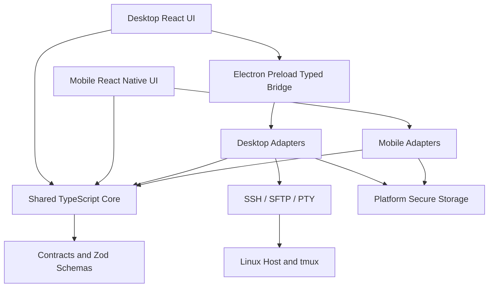

# CozyPad V2 分離式客戶端重構規格

| 欄位 | 內容 |
| --- | --- |
| 文件版本 | 0.1 |
| 文件狀態 | Proposed Target-State |
| 最後更新 | 2026-07-28 |
| 現行規格 | `SPEC.md`（As-Is，不由本文件覆蓋） |
| 決策主題 | Desktop／Mobile 分離、共享核心、Terminal 重建 |

> 本文件是 CozyPad V2 的目標架構與遷移規格。Flutter 版本在 V2 達成 release gate 前仍是正式版本，不採 big-bang rewrite。

## 1. 執行摘要

CozyPad V2 採用以下技術組合：

| 範圍 | 選用技術 |
| --- | --- |
| 主要語言 | TypeScript |
| Desktop App | Electron + React + Vite |
| Desktop Terminal | xterm.js + SSH PTY stream |
| Desktop SSH／SFTP | Node.js `ssh2` adapter |
| Mobile App | React Native + Expo + Expo Router |
| Monorepo | pnpm workspace |
| 共享核心 | 純 TypeScript packages，不依賴任何 UI framework |
| Runtime validation | Zod schema |
| Desktop secrets | Electron `safeStorage` |
| Mobile secrets | Expo `SecureStore` |
| 測試 | Vitest、Playwright、React Native Testing Library |

核心原則：

1. Desktop 與 Mobile 使用各自適合的 UI，不要求畫面元件共用或 pixel parity。
2. Domain model、use case、事件、命令、權限政策及序列化格式必須共用。
3. SSH、Terminal、Secure Storage、Filesystem 等平台能力以 adapter 實作。
4. UI 不得直接操作 SSH client、檔案系統、secret 或 LLM API。
5. 先完成 Desktop terminal vertical slice，再決定是否全面遷移。

## 2. 為什麼要重構

### 2.1 現況問題

Graphify 對目前 `lib/` 的分析顯示：

- `SSHProvider` degree 為 56，是目前最主要的跨模組 bridge。
- Hermes、Files、Agents、Commands、Dashboard、Monitor、Login 與 Tasks 均直接依賴 `SSHProvider`。
- SSH transport、狀態管理、資料持久化、任務執行、terminal、檔案與 UI notification 集中於同一 provider。
- 即使直接更換 UI framework，若保留同樣的責任集中方式，新版本仍會快速形成 God Object。

### 2.2 重構動機

- Flutter Desktop 開發環境對非 Flutter coworker 的進入成本偏高。
- 目前 terminal emulator 在 IME、Unicode、控制序列、alternate screen、mouse mode 或完整 TUI 相容性上不足。
- Desktop 與 Mobile 的資訊密度、輸入方式及主要任務不同，不適合被迫共用同一套 widget tree。
- Hermes、任務、tmux、專案及 approval policy 應是產品核心，不應綁定 Flutter。

## 3. 產品定位

### 3.1 Desktop

Desktop 是完整工作站，負責：

- SSH Connection 與 host verification。
- 完整 terminal 工作區。
- 遠端檔案瀏覽、預覽及編輯。
- CPU、Memory、GPU 與 process 監控。
- 任務建立、執行與取消。
- Hermes 完整對話、tool trace、approval 與設定。
- Project/codebase 管理。

### 3.2 Mobile

Mobile 是 companion，不是縮小版 IDE。MVP 負責：

- 查看主機連線與健康狀態。
- 查看 CPU、Memory、GPU 與任務。
- 啟動、取消及核准任務。
- Hermes 對話與高風險操作核准。
- 列出、擷取及送出簡短輸入至 persistent tmux session。
- 瀏覽檔案 metadata 與小型文字預覽。

Mobile MVP 不包含：

- 完整多分頁 terminal emulator。
- 大型檔案編輯。
- Excel、PDF、影片等複雜預覽。
- 與 Desktop 完全相同的 dashboard layout。

## 4. 框架決策

| 方案 | Onboarding | Terminal 適配 | 核心共用 | 代價 | 決策 |
| --- | --- | --- | --- | --- | --- |
| 繼續 Flutter | 需 Flutter SDK 與 Desktop toolchain | 目前已遇到 emulator 限制 | 高 | 遷移成本最低，但主要痛點未解 | 不作為 V2 主線 |
| Electron + React／React Native | Desktop 一般貢獻者主要只需 Node + pnpm | xterm.js 生態成熟 | TypeScript 可直接共用 | Desktop binary 與記憶體較大 | **採用** |
| Tauri + React／React Native | 需 Node、Rust、Windows C++ Build Tools、WebView2 | 可用 xterm.js | 可共用 TS，另有 Rust boundary | 工具鏈更多、IPC/FFI 複雜 | 暫不採用 |
| WinUI + SwiftUI + Kotlin | 各平台最原生 | Desktop 可深度客製 | 很低 | 三套 UI／語言，團隊成本最高 | 不採用 |
| Kotlin Multiplatform／Compose | Android 與 shared logic 良好 | Desktop terminal 生態仍需額外整合 | 中高 | iOS 與 Electron 生態整合不自然 | 不採用 |

### 4.1 為什麼選 Electron

- Electron 的 main process 可持有 SSH、SFTP、secret 與 filesystem 等 privileged capability。
- Renderer 使用 React，讓熟悉 Web 的 coworker 能快速參與。
- xterm.js 可處理 `bash`、`vim`、`tmux`、curses、mouse event、CJK、emoji 與 IME。
- Electron 開發版由 npm 下載預建 binary；一般 UI 開發不需編譯 Chromium 或安裝 Rust。
- 代價是較大的安裝包與記憶體使用量。CozyPad 是 developer workstation，此取捨可接受。

### 4.2 「完整 terminal」的正確定義

xterm.js 是 terminal frontend，不是 shell，也不是 OS 原生 terminal control。完整 terminal 需要三層：

```text
Keyboard / IME
      │
      ▼
xterm.js terminal emulator
      │ typed IPC
      ▼
SSH adapter → remote PTY → bash / tmux / vim / htop
```

CozyPad 的要求是 terminal fidelity，而不是一定使用 OS 內建 terminal widget。Desktop 必須使用真正的 remote PTY stream；不得把 command output 模擬成 terminal。

## 5. Target Architecture



### 5.1 Dependency Rule

- `contracts` 不得 import `core`、React、Electron 或 React Native。
- `core` 只能 import `contracts` 及純 TypeScript utility。
- `desktop-main`、`desktop-renderer` 與 `mobile` 可以 import `core`。
- `core` 不得 import `ssh2`、Electron、Expo 或任何 UI component。
- Adapter 實作 port；use case 只依賴 port interface。
- Desktop Renderer 不得 import Node.js privileged module。

### 5.2 「共享核心」的範圍

必須共享：

- Connection、Project、Task、tmux session、Hermes session 等 domain model。
- Connection state machine。
- Task lifecycle 與取消規則。
- Telemetry parser 及 normalization。
- Project/codebase mapping。
- Hermes conversation orchestration。
- Tool registry metadata。
- Approval policy 與 command risk classification。
- Event／command schema、錯誤碼及 serialization。

不得強迫共享：

- React component。
- Desktop layout 與 Mobile navigation。
- Secure storage 實作。
- SSH library 實作。
- Terminal renderer。
- File picker、notification、clipboard 等平台 UI。

## 6. Repository Layout

```text
cozypad/
├─ apps/
│  ├─ desktop/
│  │  ├─ main/                 # Electron main + privileged adapters
│  │  ├─ preload/              # narrow typed contextBridge
│  │  └─ renderer/             # React UI + xterm.js
│  └─ mobile/
│     ├─ app/                  # Expo Router routes
│     └─ src/                  # React Native screens/adapters
├─ packages/
│  ├─ contracts/               # types, Zod schemas, protocol versions
│  ├─ core/                    # domain models and use cases
│  ├─ hermes-core/             # provider-neutral harness and policies
│  ├─ telemetry/               # Linux/GPU output parsers
│  ├─ test-fixtures/           # SSH/terminal/telemetry golden fixtures
│  └─ design-tokens/           # color, spacing, typography tokens only
├─ docs/
│  ├─ adr/
│  └─ migration/
├─ legacy/
│  └─ flutter/                 # 遷移期間保留；完成後再決定是否移入
├─ pnpm-workspace.yaml
├─ package.json
└─ SPEC_V2.md
```

> 初始遷移不應立刻移動現有 Flutter 目錄。先建立 `apps/desktop` 與 `packages/*`，通過 Desktop vertical slice gate 後再調整 legacy layout。

## 7. Shared Core Interfaces

### 7.1 Ports

```ts
interface RemoteConnectionPort {
  connect(profileId: string): Promise<void>;
  disconnect(): Promise<void>;
  execute(command: ApprovedCommand): Promise<CommandResult>;
  openTerminal(request: TerminalOpenRequest): Promise<TerminalSessionId>;
  resizeTerminal(id: TerminalSessionId, cols: number, rows: number): Promise<void>;
  sendTerminalInput(id: TerminalSessionId, data: Uint8Array): Promise<void>;
}

interface RemoteFilePort {
  list(path: RemotePath): Promise<DirectoryListing>;
  read(request: FileReadRequest): Promise<FileContent>;
  write(request: ApprovedFileWrite): Promise<void>;
  move(request: ApprovedMove): Promise<void>;
  remove(request: ApprovedDelete): Promise<void>;
}

interface SecretStorePort {
  get(key: SecretKey): Promise<string | null>;
  set(key: SecretKey, value: string): Promise<void>;
  remove(key: SecretKey): Promise<void>;
}
```

### 7.2 Commands and Events

所有平台必須使用相同 schema：

- `ConnectRequested`
- `ConnectionStateChanged`
- `TelemetrySnapshotReceived`
- `TerminalOpened`
- `TerminalOutputReceived`
- `TerminalResizeRequested`
- `TaskLaunchRequested`
- `TaskStateChanged`
- `ToolApprovalRequested`
- `ToolApprovalResolved`
- `HermesTurnStarted`
- `HermesToolObservationReceived`
- `HermesTurnCompleted`

每個 message 必須包含：

- `protocolVersion`
- `requestId` 或 `eventId`
- `timestamp`
- `profileId`
- `projectId`（可選）
- typed payload

## 8. Desktop Specification

### 8.1 Process Boundaries

#### Main process

- 持有 SSH／SFTP connection。
- 持有 remote PTY streams。
- 存取 secret、filesystem、native dialog 與 app lifecycle。
- 執行 telemetry polling 與 Hermes remote tools。
- 不執行 React rendering。

#### Preload

- 只以 `contextBridge` 暴露具名、窄範圍 API。
- 不得直接暴露 `ipcRenderer.send`、filesystem 或 arbitrary command。
- 所有 request 與 response 必須通過 Zod validation。

#### Renderer

- `nodeIntegration: false`。
- `contextIsolation: true`。
- Renderer sandbox 必須保持啟用。
- 只載入 packaged local UI。
- 套用嚴格 Content Security Policy。

### 8.2 Terminal Pipeline

```text
xterm.onData()
  → preload terminal.writeInput()
  → validated IPC
  → ssh2 shell stream
  → remote PTY

remote PTY data
  → main process
  → bounded/chunked IPC event
  → xterm.write()
```

- Remote SSH terminal 使用 `ssh2.Client.shell()`。
- Resize 必須同步 xterm cols/rows 與 remote PTY window size。
- Local shell 才考慮 `node-pty`；Remote SSH 不得為了 terminal 顯示而額外啟動本機 shell。
- 使用 `@xterm/addon-fit`。
- WebGL renderer 為 opt-in acceleration，失敗時回退 DOM renderer。
- Search、serialize、web-links 與 Unicode addon 依驗收結果啟用。
- Terminal output 必須使用 binary-safe stream，不得透過 line-based parser。

### 8.3 Terminal Acceptance Matrix

下列情境必須在 Windows release gate 通過：

| 情境 | 驗收 |
| --- | --- |
| shell | bash prompt、history、Ctrl+C、Ctrl+D、Tab completion |
| TUI | `vim`、`nano`、`htop`、`less`、`tmux` |
| screen mode | alternate screen 進出後內容正確 |
| colors | ANSI 16／256 color 與 true color |
| input | 英文、繁體中文 IME、emoji、dead key |
| width | CJK wide character 與 combining character 不錯位 |
| pointer | mouse reporting、selection、wheel scrolling |
| paste | bracketed paste 與大量文字貼上 |
| resize | 視窗與 panel resize 不破壞 TUI |
| reconnect | tmux session 可重新 capture／attach |
| clipboard | copy 不把 terminal control sequence 寫入剪貼簿 |

### 8.4 Desktop SSH

- MVP 使用 Node.js `ssh2`。
- 必須支援 password、private key、passphrase 與 SSH agent。
- 必須提供 host key fingerprint 初次信任及變更警告。
- SFTP 使用同一 library adapter。
- Connection hopping／proxy jump 為 V2.1，不阻擋 V2.0。

## 9. Mobile Specification

### 9.1 Framework

- React Native。
- Expo framework。
- Expo Router。
- React Native New Architecture。
- UI-only contributor 可先使用 Expo Go。
- 需要 SSH/native adapter 時使用 Expo development build。

### 9.2 Mobile UX

- 使用 native stack、tabs、sheet、haptics 與 platform-safe-area。
- 不複製 Desktop 三欄式 layout。
- 主要操作需單手可達。
- 高風險操作必須以明確 summary 與 biometric/PIN confirmation 呈現。
- 背景狀態更新必須符合 Android/iOS background execution 限制。

### 9.3 Mobile Transport Gate

React Native 無法直接使用依賴 Node.js runtime 的 Desktop `ssh2` adapter，因此 V2 必須先執行 transport spike：

#### Option A：Native SSH adapter

- 以 Expo Module API 包裝平台 SSH implementation。
- 必須通過 password、key、host verification、tmux capture 與 cancellation 測試。
- 適合希望 Mobile 可直接連線主機的產品方向。

#### Option B：CozyPad Remote Runtime API

- Mobile 透過 authenticated WSS／HTTPS 連接遠端 runtime。
- Desktop 仍可透過 SSH bootstrap、upgrade 及建立安全 tunnel。
- 適合降低 Mobile native SSH 複雜度，但增加 remote agent 的部署與安全責任。

在 spike 完成前不得宣稱 Mobile direct SSH 已確定。選擇標準：

- Security review。
- iOS／Android 可維護性。
- 斷線重連。
- 背景限制。
- App Store policy。
- contributor setup。

## 10. State and Persistence

### Shared serialized state

- Connection metadata，不含 secret。
- Project 與 codebase mappings。
- Task definition 與 history。
- Hermes session metadata。
- Tool approvals audit log。
- UI-independent preferences。

### Platform-local state

- Password、private key passphrase、API key。
- Window layout、mobile navigation state。
- Terminal font、renderer 與 accessibility preference。
- Platform biometric setting。

### Secret storage

- Desktop 使用 Electron `safeStorage` asynchronous API。
- Mobile 使用 Expo `SecureStore`。
- 大型 private key material 可存加密檔案；secure store 只保存 wrapping key／reference。
- Secret 不得經過 Renderer Redux/React state、log、analytics 或 crash report。

## 11. Hermes Refactor

`hermes-core` 必須是 provider-neutral 且 UI-neutral：

- `HermesSessionStore`
- `HermesMemoryStore`
- `HermesApprovalPolicy`
- `HermesToolRegistry`
- model provider interface
- tool execution port
- event stream

Desktop 與 Mobile 可使用不同呈現：

- Desktop：完整 trace、arguments、observations、memory editor。
- Mobile：對話、狀態摘要、approval inbox、簡化 tool result。

高風險工具不得因平台不同而有不同預設政策。

## 12. Developer Experience

### 12.1 Desktop／shared contributor

必要工具：

- Git
- Node.js LTS
- Corepack／pnpm

預期流程：

```bash
corepack enable
pnpm install
pnpm dev:desktop
```

一般 Desktop UI、shared core 與測試修改不得要求 Flutter、Dart、Rust、Visual Studio C++ workload 或 Android Studio。

### 12.2 Mobile contributor

- UI-only：Node.js、pnpm、Expo Go 可開始大部分畫面工作。
- Native integration：Android Studio；iOS native build 需要 macOS 與 Xcode。
- 可使用預先建立的 development build，避免每位 UI contributor 都重建 native binary。

### 12.3 Onboarding SLO

在正常網路與支援 OS 上，新 coworker 必須能在 15 分鐘內：

1. Clone repository。
2. 安裝 JS dependencies。
3. 啟動 Desktop mock mode。
4. 修改一個 React component。
5. 執行 unit test。

不連接真實 SSH 主機也必須能用 fixture／mock 開發。

## 13. Migration Plan

### Phase 0：Characterization

- 保存目前 telemetry、file listing、task、Hermes tool protocol 的 fixtures。
- 建立 terminal escape sequence 與 TUI 驗收清單。
- 凍結現行 model JSON 範例。
- 不修改現有 Flutter release 行為。

### Phase 1：Shared Core

- 建立 pnpm monorepo。
- 建立 `contracts`、`core`、`telemetry`。
- 將 parser、state machine 與 approval policy 以測試先行移植。
- Flutter 版本仍正常發佈。

### Phase 2：Desktop Terminal Vertical Slice

只完成：

```text
Create profile → SSH connect → host verify → open PTY
→ xterm interaction → resize → tmux reconnect → disconnect
```

通過 terminal acceptance matrix 後才進 Phase 3。若失敗，停止全面 rewrite 並重新評估 terminal engine。

### Phase 3：Desktop Core Workspaces

- Monitor。
- Files。
- Tasks。
- Projects。
- Settings／secret migration。

### Phase 4：Hermes

- 移植 harness、memory、session、provider 與 approval。
- 對照 Flutter golden fixtures。

### Phase 5：Mobile Companion

- 完成 Mobile transport spike。
- 建立 Monitor、Tasks、Hermes approval、tmux remote control。
- 不以完整 terminal 阻擋 Mobile MVP。

### Phase 6：Cutover

- 雙版本 beta。
- 匯入 Flutter secure data 的一次性 migration tool。
- 完成 crash-free、security 與 feature parity gate。
- 才停止 Flutter feature development。

## 14. Release Gates

### Gate D0：Architecture

- Dependency rules 以 lint／test 自動驗證。
- Shared core 不含 Electron／React Native dependency。
- IPC schema 有 runtime validation。

### Gate D1：Terminal

- Terminal acceptance matrix 全數通過。
- 連續輸出 30 分鐘無 freeze 或無界記憶體成長。
- 斷線、network flap 與 tmux reconnect 可恢復。

### Gate D2：Security

- Host key verification 完成。
- Renderer sandbox、context isolation、CSP 及 sender validation 完成。
- Secret 不出現在 renderer storage 或 logs。
- Mutating Hermes tool 必須明確 approval。

### Gate D3：Desktop Beta

- Monitor、Files、Terminal、Tasks、Projects、Hermes 可用。
- Windows installer 與 auto-update 完成。
- 可從 Flutter 版本匯入 profiles/projects。

### Gate M0：Mobile Transport

- Option A 或 B 有實機 proof。
- iOS／Android 均通過 auth、reconnect 與 approval flow。
- 完成 threat model 後才進 Mobile feature build。

## 15. 風險

| 風險 | 緩解 |
| --- | --- |
| Electron 記憶體與安裝包較大 | 以 workstation 定位接受；監控 renderer 數量與 bundle |
| Electron privileged surface | main/renderer 隔離、CSP、typed IPC、sender validation |
| xterm.js 仍不是 OS native control | 以 terminal fidelity matrix 驗收，不以名稱判斷 |
| Mobile SSH 生態不確定 | Gate M0 spike；保留 remote runtime API 選項 |
| TypeScript core 仍可能被 UI 汙染 | dependency rule、package boundary、ports/adapters |
| Big-bang rewrite 造成長期無 release | vertical slice gates，Flutter 保持可發佈 |
| Desktop/Mobile 行為分歧 | 共用 commands/events schemas 與 contract tests |

## 16. 明確不採用的策略

- 不把現有 Dart 檔逐檔翻譯成 TypeScript。
- 不在 React component 中重建 `SSHProvider`。
- 不讓 Electron Renderer 直接存取 Node／SSH。
- 不要求 Mobile 複製 Desktop terminal 或 file editor。
- 不在 terminal vertical slice 未驗證前移植所有功能。
- 不在 V2.0 同時導入 Electron、Tauri、Rust core 及 remote daemon。

## 17. 決策來源

- 現況架構：`graphify-out/GRAPH_REPORT.md`。
- Electron process model：[Electron documentation](https://www.electronjs.org/docs/latest/tutorial/tutorial-first-app)。
- Electron security：[Electron Security Checklist](https://www.electronjs.org/docs/latest/tutorial/security)。
- Electron secret storage：[safeStorage](https://www.electronjs.org/docs/latest/api/safe-storage)。
- Terminal frontend：[xterm.js](https://github.com/xtermjs/xterm.js)。
- Node SSH／PTY／SFTP：[ssh2](https://github.com/mscdex/ssh2)。
- React Native framework guidance：[React Native — Get Started](https://reactnative.dev/docs/environment-setup)。
- Mobile development builds：[Expo Development Builds](https://docs.expo.dev/develop/development-builds/introduction/)。
- Mobile navigation：[Expo Router](https://docs.expo.dev/router/introduction/)。
- Mobile secret storage：[Expo SecureStore](https://docs.expo.dev/versions/latest/sdk/securestore/)。
- Monorepo：[pnpm Workspaces](https://pnpm.io/workspaces)。
- Tauri setup comparison：[Tauri Prerequisites](https://v2.tauri.app/start/prerequisites/)。

